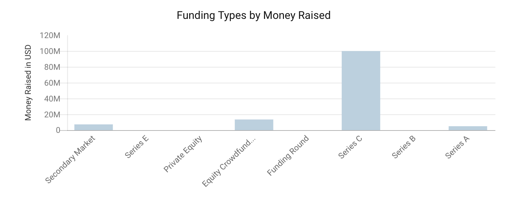
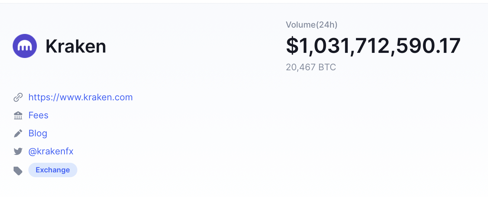
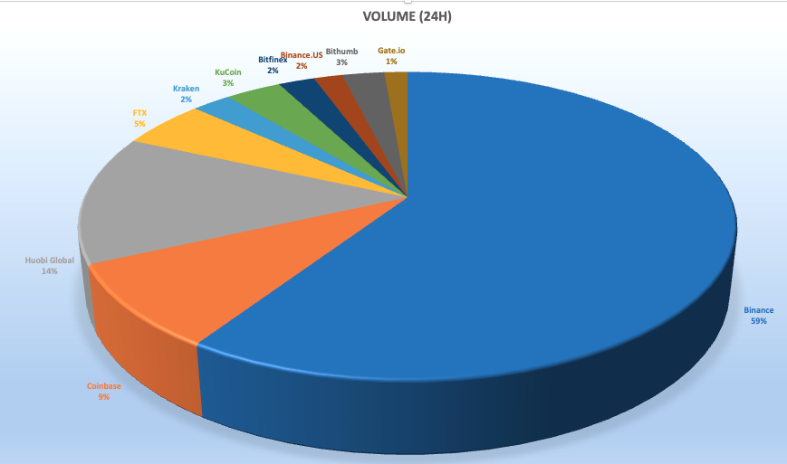

# Case Study-Kraken

## **Overview and Origin of Kraken**

### *When was the company incorporated?* 

 

*Figure 1: Kraken's official logo*

Kraken was incorporated on June 28, 2011.(Kraken, 2021)

### *Who are the founders of the company?*

 

*Figure 2: Jesse Powell, Co-Founder and CEO of Kraken*

Kraken was founded by Jesse Powell on June 28. 2011. (Kraken, 2021)

### *How did the idea for the company (or project) come about?*

The idea arose out of hacked crypto currency company, Mt. Gox, “Powell, co-founder and CEO of Kraken, stated “It was clear after that hack at Mt. Gox, when they were down for like a week, that the exchange is really the most critical piece of the ecosystem," (Alpeyev, Mint, 2014), at that point is where he realized that Mr. Gox was in trouble and he explained “I wanted there to be another one to take its place, if Mt. Gox failed.” Frankenfield, 2021). So, he started Kraken. Jesse Powell started Kraken “to help displaced customers from the Mt. Gox exchange hack that drained over $450 million in Bitcoin from investors” (Wade, 2021). 

### How is the company funded? How much funding have they received?

Kraken has raised funds by Private Equity, Secondary Market, Equity Crowdfunding, and Series A funding. As of July 1, 2021 they have received $125.8 Million dollars in funding(Crunchbase, 2021). See Figure 2 below. 

 
*Figure 3: Funding Types by Money Raised for Kraken. Source (Crunchbase, 2021).*

## **Business Activities**

### *What specific financial problem is the company or project trying to solve?*

Kraken is one of many crypto exchange companies out there. “Powell founded Kraken to help ordinary people quickly and securely invest in Bitcoin and/or other coins.” Powell “told Bloomberg in a 2014 interview, that a crypto exchange is “really the most critical piece of the ecosystem””. (Derrick, 2021).

Over the years Kraken has evolved in the cryptocurrency arena, “as of 2020, Kraken was one of the only two (Elliot, 2021) cryptocurrency exchanges to be legally chartered as banks in the US.” (Derrick, 2021)

### *Who is the company's intended customer?*

According to Kraken.com they cater to advanced traders or a crypto-beginner, “Kraken gives you the power to chart your own financial course” (Kraken, 2021)

### *Is there any information about the market size of this set of customers?*

 *Figure 4: In this figure, we can see how much cryptocurrency or BTC (Bitcoin, digital currency) has been traded over the past 24 hours as of September 5, 2021. Source (CointMarketCap, 2021)*

If we measure the makert size based on trading value of each makert exchange, Kraken is ranked number 5 out 306 existing market exchange.(CointMarketCap, 2021).

To put things in prospective, Kraken holds 2% of the market share in the crypto currency trading market, with Bianance taking the majority of the market share at 59% of the market share, followed by Huobi Global, Coinbase, and FTX. See Figure 5. (CointMarketCap, 2021).

 

*Figure 5: Cryto Currency Market Share by Trading Volume in the last 24 hours, as of September 6, 2021. Data for this chart was obtained from "coinmarketcap.com"*

### *What solution does this company offer that their competitors do not or cannot offer? (What is the unfair advantage they utilize?)*

Kraken offer solutions that are comparable to its competitors. Karken's top advantage is it's security ratings. “ Since its inception Kraken has been committed to building a crypto platform with the highest standards for security, performance and reliability.”   (KrakenFx, 2021). In the digital world of trading that is one of the most valuable assets. It also supports most countries, in comparison with its counterparts. This is one of their key competitive advantages. (Gewirtz, 2021). Additionally, “Kraken is the only exchange that offer access to Monero” (Marquit, 2021). “If you’re more interested in altcoins, Kraken has the most value”. Kraken also “offers a wide variety of order types, as well as access to margin”. (Marquit, 2021).

### *Which technologies are they currently using, and how are they implementing them?* 

 
Since its foundation, Kraken, utiliized PHP.  Back then "PHP offered a mix of execution safety, speed and productivity."  Today, "Kraken has entered a stage of hypergrowth with which the code base and tools need to keep up." "For more than two years now, Kraken's core Backend team has been using Rust to modernize services originally wirtten in PHP, while buidling new products, expanding the feature set and supporting the ever expanding increase in cryptocurrency trading activity." (KrakenFx, 2021).

## **Landscape**

### *What domain of the financial industry is the company in?*

Kraken falls into the FinTech Fianancial Industry under the Blockchain and Cryptocurrencies. FinTech is defined as "Financial Technology that is used to describe new tech that seeks to improve and automate the delivery and use of financial services."  (Kagan, 2020). This industry "includes the development and use of crypto-currencies such as bitcoin." (Kagan, 2020).

### *What have been the major trends and innovations of this domain over the last 5-10 years?*

Over the last decade Financial Technology has disrupted the regual financial systems and the way we do and conduct business. "It has given smaller companies to access to capital that otherwise was not there before. If one word can describe how many fintech innovations have affected traditional trading, banking, financial advice, and products, it's 'disruption,' like financial products and services that were once the realm of brances, salesmen and desktops move toward mobility devices or simply democratize away from large, entrenched instituions." (Kagan, 2020).

### *What are the other major companies in this domain?*

Coinbase it is their biggest competitors in the US, however, currently, there are 306 crypto currency market exchange. The top 5 are listed below: 

1. Coinbase
2. Huobi Global
3. Binance
4. FTX
5. Kraken
(Elliot, 2021)

## **Results**

### *What has been the business impact of this company so far?*

So far, this company has been leading in the crypto currency makert globally. It is also continuing to innovate by accepting new crypto currencies for trading such as Shiden (SDN). It has also created a new statistical model for bitcoin's hashrate. (blog.kraken.com). It recently released an developed three (3) mobile apps for it users. Lastly, Kraken has built trust. Kraken "is trusted by more than 7 million trades, institutions and authorities around the world" (KrakenFx, 2021)

## *Recommendations*

## *If you were to advise the company, what products or services would you suggest they offer? (This could be something that a competitor offers, or use your imagination!)*

I would suggest they offer one-on-one training for new customers. In particular because of the complexity of the trading operations and their complexity of their user interface. Additionally, I would suggest Kraken and a new divsion of its company to provide merchatibility of crypto currency. Since, security is at Kraken's core, I wold also suggest the company create a wallet for its consumers to store their currency. 

## *Why do you think that offering this product or service would benefit the company?*
 

Based on the company review and suggestions, the one thing custumers complain about is the lack of user friend interface and complicated start up. Additionally, Kraken's competitors do offer a "wallet" to store crypto currency. Lastly, being that Kraken is ontop of innovation creating a interface between crypto currency and local merchants around the world would give them a tremendous competitive advantate. 

## *What technologies would this additional product or service utilize?*

Audio-Visual technology would work the best for the one-on-one training approach, along with the use human capital for the training option. 

Creating an interface between Crypto Currency and existing financial companies such as such as, Visa, Master Card and American Express and creating a user interface

## *Why are these technologies appropriate for your solution?*

This new technology would merge/interface/connect with existing and established fiancial institutions with distribution and networking power and would eliminate the need of creating a new market for crypto currency while creating confidence in the currency itself. 

This Wallet would give its users the ability to seamlessly use the funds in day to day trranscations. 

## Works Cited

Alpeyev, P. (2014, August 18). Mint. Retrieved from livemint.com: https://www.livemint.com/Money/1LnDNJsAGKSU9AJaxePHnI/Mt-Gox-insiders-Kraken-bitcoin-exchange-to-open-in-Japan.html

CointMarketCap. (2021). coinmarketcap.com. Retrieved from https://coinmarketcap.com/exchanges/kraken/: https://coinmarketcap.com/exchanges/kraken/

Crunchbase. (2021, August 31). Retrieved from Crunchbase: crunchbase. com

Derrick, J. (2021, August). https://capital.com. Retrieved August 29th, 2021, from Capital.com : https://capital.com/kraken-considers-going-public-in-2022

Derrick, J. (n.d.). Capital.com. Retrieved from Capital.com: https://capital.com/kraken-considers-going-public-in-2022

Elliot, J. (2021, May 25). investopedia.com. Retrieved from Investopedia: https://www.investopedia.com/kraken-vs-coinbase-5120700

Frankenfield, J. (2021, Mar 26). Investopedia. Retrieved from Investopedia : https://www.investopedia.com/terms/m/mt-gox.asp

Gewirtz, D. (2021, Jun 17). ZDNet. Retrieved from zdnet.com: https://www.zdnet.com/article/best-crypto-exchange/

Kagan, J. (2020, Aug 28). Ivestopedia.com. Retrieved from Investopedia: https://www.investopedia.com/terms/f/fintech.asp

Kraken. (2021, Aug 29). Kraken.com. Retrieved from kraken.com: kraken.com

KrakenFx. (2021, Feb 19). Kraken Engineering Blog. Retrieved from https://blog.kraken.com/post/7941/welcome-to-the-kraken-engineering-blog/

Marquit, M. (2021, Aug 19). FinanceBuzz . Retrieved from Finance BUzz : https://financebuzz.com/kraken-vs-coinbase-vs-gemini

Wade, J. (2021, May 25). the balance . Retrieved from https://www.thebalance.com/kraken-vs-coinbase-5119424: www.thebalance.com

